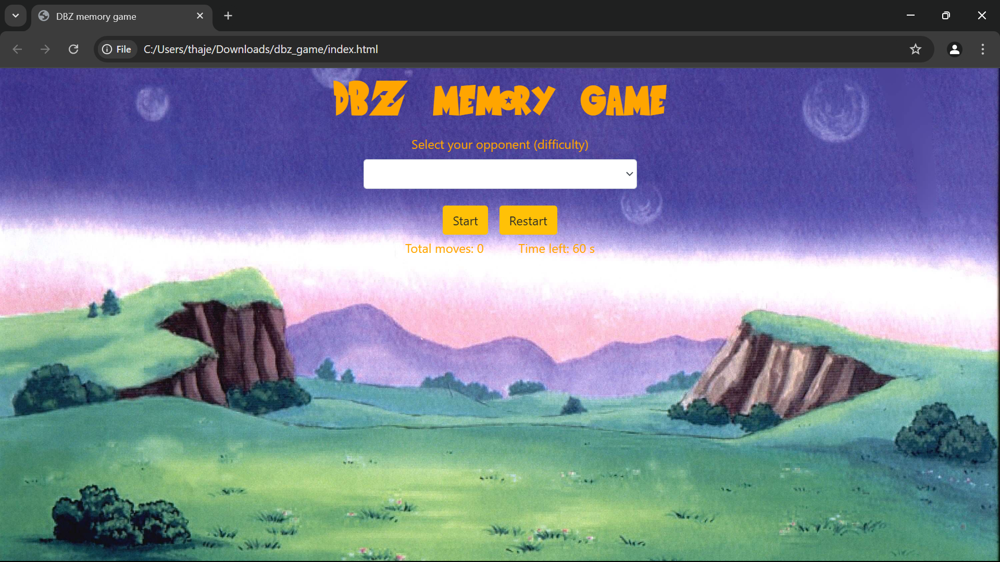
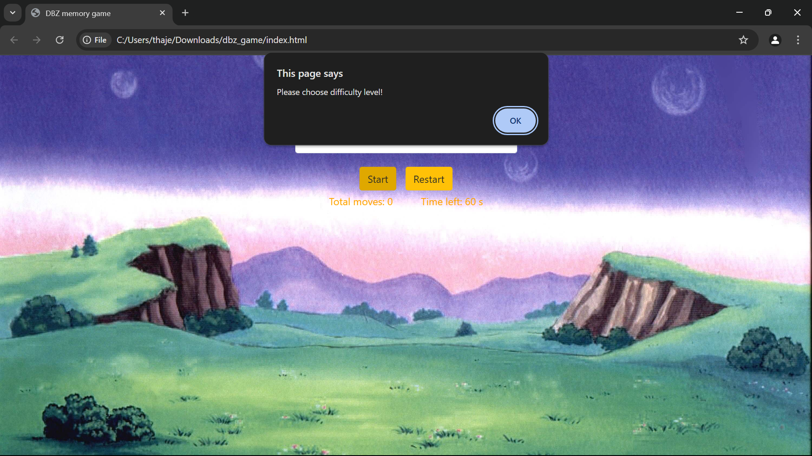
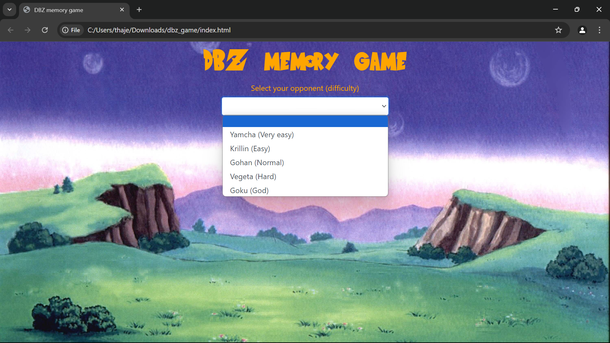
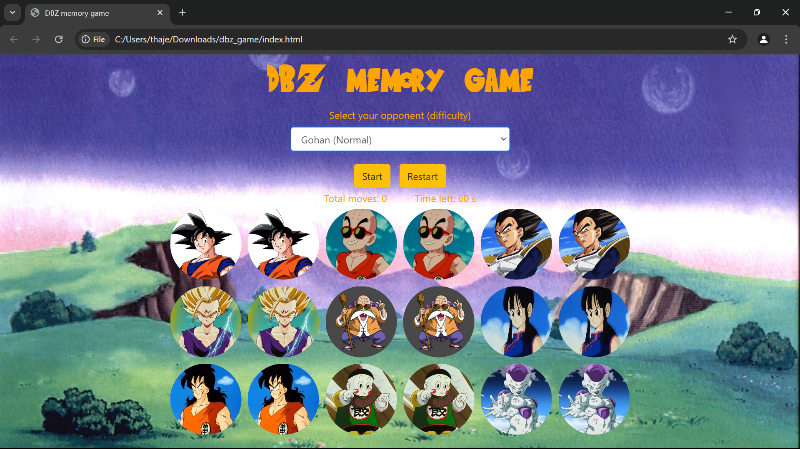
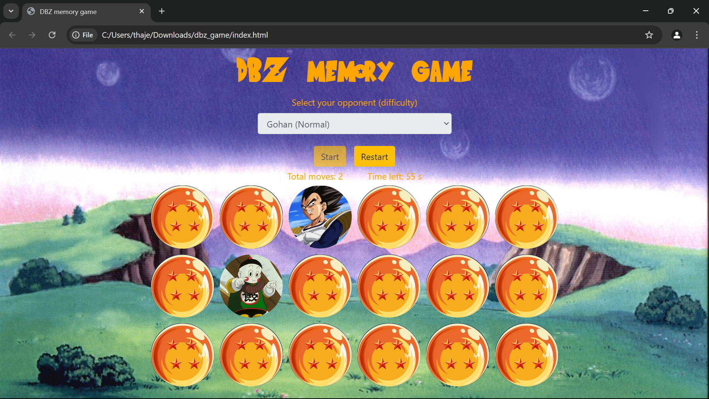
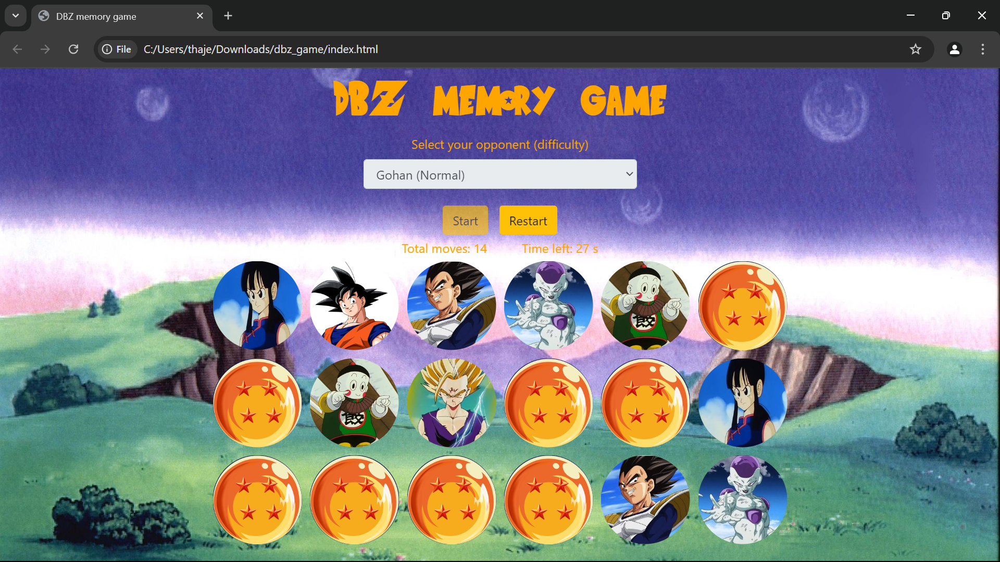
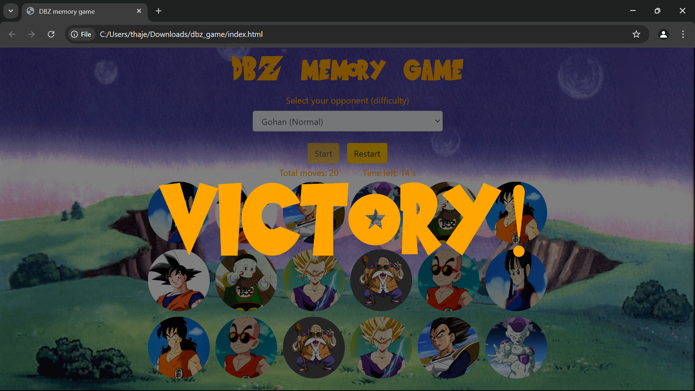
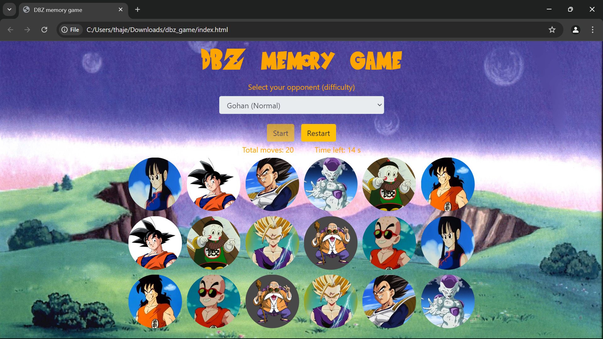
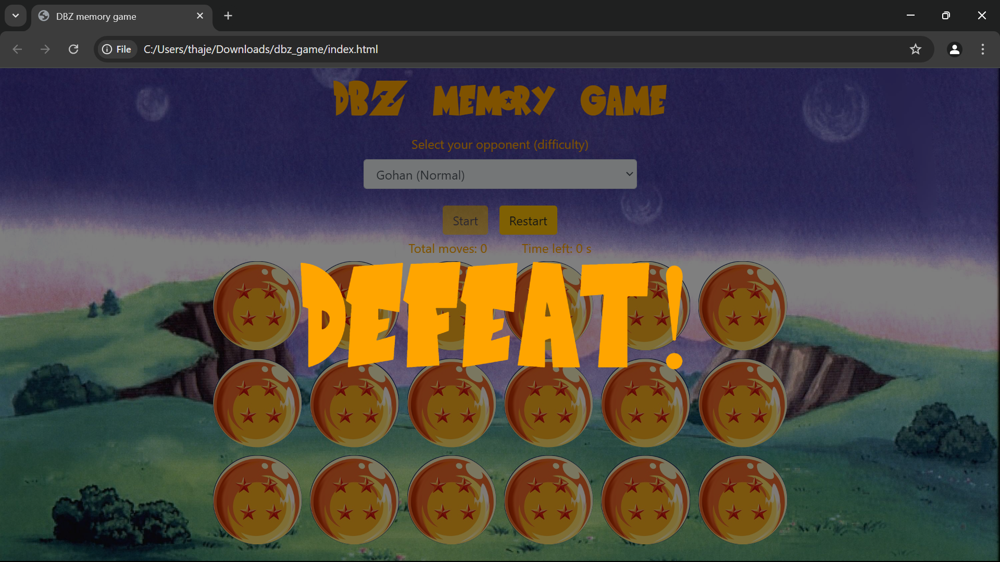
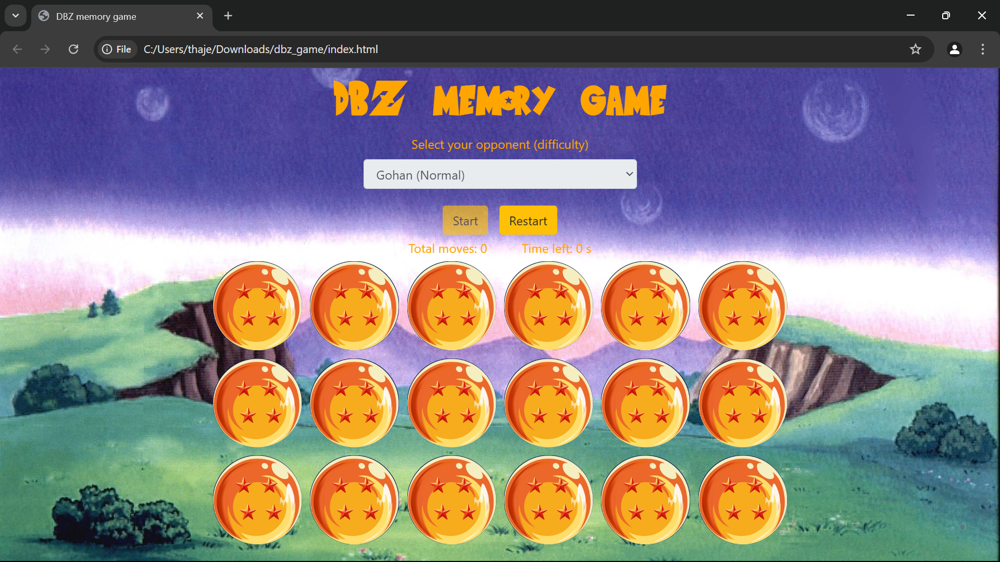

# Dragonball Z Memory Game

### [Link](https://thajeepan-rathiharan.github.io/planet_defence_game/)

## How to play

Start by clicking on the link to go to the site.

You need to choose a difficulty in the menu bar, or else when you press "Start", the browser will pop up this error message.

Once you have selected a diffulty from the options below, press the "Start" button.

You will be given as much time as you need to try memorising the cards. Once you think you've memorised it, press the "Start" button again so they get shuffled and the timer starts counting down from 60 seconds.

Press the cards and try to match the cards.

Progress of matching the cards.

Victory message appears when you finish the game.

Click on the page again to see the cards, and you can press the "Restart" button to replay the game to beat the time, or try a higher difficulty.

If you don't match all cards within the 60 second time limit, a "Defeat" message appears on the screen. 

Don't worry you can click on the page and press the "Restart" button to reattempt it, or play again on a lower difficulty.

## Features of the site     
* Fun memory game for anyone.
* Reponsive as it works on desktops and tablets.

## Coding Languages used to create this
* HTML
* CSS
* JavaScript

## Software used
* Visual Studio Code

## Deployment

The website was deployed to Github in the following method:
  
1. Going to my GitHub repository on GitHub.
2. Clicking on "Settings" in my repository.
3. Clicking on "Pages"(tab on the left sidebar) in my repository.
4. Scrolling down to "Build and deployment"/"Source" section.
5. Find the sub-section "Branch".
6. From the drop-down menu "none"/"select branch" and choose source "main".
7. Click 'Save'.
8. Then waited until I saw a link for the deployed page within GitHub Page section. This can take a while. Once the page updates I got this message: Your site is live at https://thajeepan-rathiharan.github.io/planet_defence_game/.